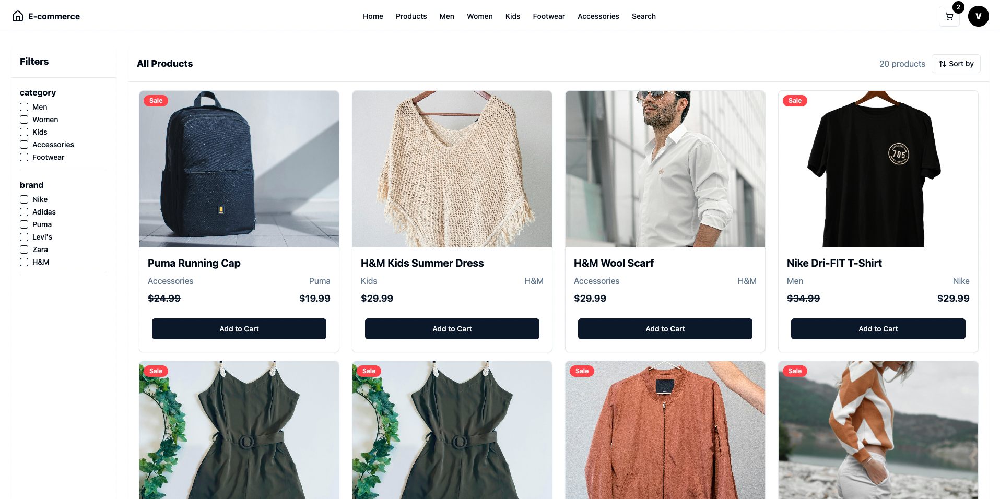

# Fashion E-Commerce Platform

**Fashion E-Commerce** is a full-stack web platform that allows users to browse and purchase clothing online, with a dedicated admin interface.

## Live Demo

Visit the live application at: [https://e-commerce-frontend-uydm.onrender.com](https://e-commerce-frontend-uydm.onrender.com)

## Features

- **Customer Interface**:

  - Browse products by categories and brands
  - Shopping cart system
  - Secure PayPal payments
  - Product reviews and comments system
  - Real-time stock management

- **Admin Interface**:
  - Product management (CRUD)
  - Categories and brands management
  - Order tracking
  - Stock management
  - Comment moderation

## Tech Stack

**Frontend**: React, Vite, Redux Toolkit, Radix UI, Tailwind CSS  
**Backend**: Node.js, Express, MongoDB  
**Payment**: PayPal  
**Image Upload**: Cloudinary  
**Deployment**: Render

## Repositories

- **Frontend**: [e-commerce-frontend](https://github.com/vinesk/e-commerce-frontend)
- **Backend**: [e-commerce-backend](https://github.com/vinesk/e-commerce-backend)

## Setup

### Frontend

1. Clone the frontend repo:

   ```bash
   git clone https://github.com/vinesk/e-commerce-frontend.git
   cd e-commerce-frontend
   ```

2. Install dependencies:

   ```bash
   npm install
   ```

3. Create a `.env` file based on `.env.example`:

   ```bash
   VITE_API_URL="YOUR_API_URL"
   ```

4. Start the frontend:
   ```bash
   npm run dev
   ```

### Backend

1. Clone the backend repo:

   ```bash
   git clone https://github.com/vinesk/e-commerce-backend.git
   cd e-commerce-backend
   ```

2. Install dependencies:

   ```bash
   npm install
   ```

3. Create a `.env` file based on `.env.example` with:

   ```bash
   MONGO_URL="YOUR_MONGO_URL"
   PORT="YOUR_PORT"
   CLIENT_URL="YOUR_CLIENT_URL"
   CLOUDINARY_NAME="YOUR_CLOUDINARY_NAME"
   CLOUDINARY_API_KEY="YOUR_CLOUDINARY_API_KEY"
   CLOUDINARY_API_SECRET="YOUR_CLOUDINARY_API_SECRET"
   PAYPAL_CLIENT_ID="YOUR_PAYPAL_CLIENT_ID"
   PAYPAL_CLIENT_SECRET="YOUR_PAYPAL_CLIENT_SECRET"
   ```

4. Start the backend:

   ```bash
   npm run dev
   ```

5. (Optional) Seed the database:
   ```bash
   npm run seed
   ```

## Usage

- **Navigation**: Browse products by categories or brands
- **Purchase**: Add products to cart and proceed to checkout via PayPal
- **Reviews**: Leave reviews on purchased products
- **Admin**: Access the admin dashboard to manage the platform

## License

ISC License. See the [LICENSE](./LICENSE) file for details.
